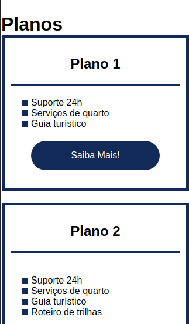

<h1 align="center"> 📝 Project flexbox DIO</h1>
<h2 align="center"> 📝 Curso posicionando Elementos com Flexbox em CSS com Karen Santos da DIO</h2>
 
<h2>Layout:</h2>

 
<h2>Design responsivo:</h2>

<strong>Resumo do curso:</strong> 
:heavy_check_mark: Estrutura básica e prática com display:flex; 
:heavy_check_mark: Estrutura básica e prática flex direction; 
:heavy_check_mark: Estrutura básica e prática flex wrap; 
:heavy_check_mark: Estrutura básica e prática flex; 
:heavy_check_mark: Estrutura básica e prática order; 
:heavy_check_mark: Estrutura básica e prática align-self; 
:heavy_check_mark: Estrutura básica e prática flex-flow; 
:heavy_check_mark: Estrutura básica e prática justify-content; 
:heavy_check_mark: Estrutura básica e prática align-items; 
:heavy_check_mark: Estrutura básica e prática align-content; 
:heavy_check_mark: Estrutura básica e prática flex-grow; 
:heavy_check_mark: Estrutura básica e prática flex-basis; 
:heavy_check_mark: Estrutura básica e prática flex-shrink; 

